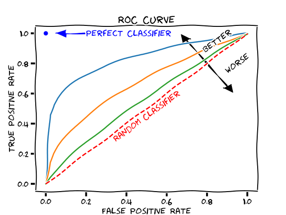

# Key terms (some may be review)

\onslide<1->**Unsupervised learning**: Using *unlabeled* datasets. \emphasis{Here, we are looking for patterns or structure within the data.}

\onslide<2->**Supervised learning**: Using *labeled* datasets (i.e., "training data"). **Semi-supervised** learning means that only some of the data are labelled. \emphasis{With supervised learning, we look to build a model from the training data.}

\onslide<3->**Active learning**: Interactively asking for labels (a form of semi-supervised learning).

\onslide<4->**Reinforcement learning**: Developing and refining models as data arrive.

# Key terms (some may be review)

\onslide<1->**Classification**: Finding a function, $f$, which maps inputs, $X$, to discrete outputs, $y$, or *classes*. When you have two target classes (e.g., Yes and No), you have a *binary classification* problem. When you have more than two classes, you have a *multiclass classification* problem.

\onslide<2->**Regression**: Finding a function, $f$, which maps inputs, $X$, to a *continuous* output, $y$. 

\onslide<3->Another way to think about it: **Classification** necessitates a *qualitative* response while **regression** necessitates a *quantitative* response.

\onslide<4->**Clustering**: An unsupervised learning approach where data are grouped together.

# Key terms (some may be review)

\onslide<1->**Bias**: The difference between the predicted and true value of some parameter.

\onslide<2->**Variance**: Change in your model's performance as different training data are used. 

# The goal of regression or classification

\onslide<1->The ultimate goal of a learning approach is to **minimize error.** That is, can you find a function, $f$, whose outputs are sufficiently close to actual outputs for the same input? 

\onslide<2->At the same time, we want to avoid *overfitting*. Why?

\onslide<3-> Terms that will come up repeatedly: **loss** and **cost** (e.g., "minimize your loss function"). **Loss** tells us how far one prediction is from some target value; **cost** describes loss across a dataset. 

# Okay, let us consider your projects --- what sort of problem are you solving?

# Regression algorithms

There are many regression algorithms. You are likely familiar with some of them, including:

\onslide<2->
- Linear: Generally speaking: $y = a_1x_1 + a_2x_2 + ... + b$ where $a_n$ are *coefficients*. A good fit minimizes the sum of squares of the *residuals* (actual value - predicted value).

\onslide<3-> 
- LASSO: A linear regression but now your loss function penalizes large coefficients (to reduce complexity): least squares + $\alpha * \sum{|a_n|}$.

\onslide<4->
- Ridge: A linear regression but now your loss function penalizes large coefficients: least squares + $\alpha * \sum{a_n^2}$.

\onslide<5->
- Polynomial regression: A non linear regression.

# Classification algorithms
Likewise, there are many classification algorithms. You have probably heard of a few, including: 

- K nearest neighbors (kNN)
- Decision trees
- Support vector machines
- Linear Discriminant Analysis (LDA)
- Naive Bayes (NB)

# On to some classification examples

Chapters 3.3 and 3.4 in the notebook

# One question: how might we describe the performance of our classifications?

Let us consider a binary classification, in which we label data either positive, $P$, or negative, $N$.

\onslide<2->You can think of the true number of positive entries being made up of **true positives** ($TP$) and **false negatives** ($FN$). 

\onslide<3->Likewise, the true number of negative entries is made up of **true negatives** ($TN$) and **false positives** ($FP$).

\onslide<4->Your predictions of $P$ and $N$ are made up of $TP + FP$ and $TN + FN$, respectively. 

# One question: how might we describe the performance of our classifications?

\onslide<1->You might build a **confusion matrix**, defined as:

\onslide<2->$\begin{bmatrix} TP & FN \\ FP & TN \\ \end{bmatrix}$

# One question: how might we describe the performance of our classifications?

Other metrics you can calculate with $P$ and $N$:

\onslide<2->
- **Error** : the fraction of the data that was misclassified 

    $err = \frac{FP+FN}{N}$  -> 0

\onslide<3->
- **Accuracy**: the fraction of the data that was correctly classified: 

    $acc = \frac{TP+TN}{N} = 1 - err$ --> 1

# One question: how might we describe the performance of our classifications?

Other metrics you can calculate with $P$ and $N$:

\onslide<2->
- **TP-rate**: the ratio of samples predicted in the *positive* class that are correctly classified:

    $TPR = \frac{TP}{TP+FN}$ --> 1
    
    \emphasis{This ratio is also the **recall** value or **sensitivity**.}

\onslide<3->
- **TN-rate**: the ratio of samples predicted in the *negative* class that are correctly classified:

    $TNR = \frac{TN}{TN+FP}$ --> 1
    
    \emphasis{This ratio is also the **specificity**.}

# One question: how might we describe the performance of our classifications?

Other metrics you can calculate with $P$ and $N$:

\onslide<2->
- **Precision**: the ratio of samples predicted in the *positive* class that were indeed *positive* to the total number of samples predicted as *positive*.

    $pr = \frac{TP}{TP+FP}$ --> 1

    \emphasis{Note that, as precision increases, recall decreases.}
 
\onslide<3->
- **F1 score**:

    $F_1 = \frac{2}{(1/ precision + 1/recall)} = \frac{TP}{TP + (FN+FP)/2}$ --> 1.

# Visualizing rates

Since the classifier uses some *threshold* value to determine which label to give a datum, we can plot the true positive rate vs. the false positive rate for different thresholds. This plot is known as the *Receiver Operating Characteristics*.

{width=40%}
